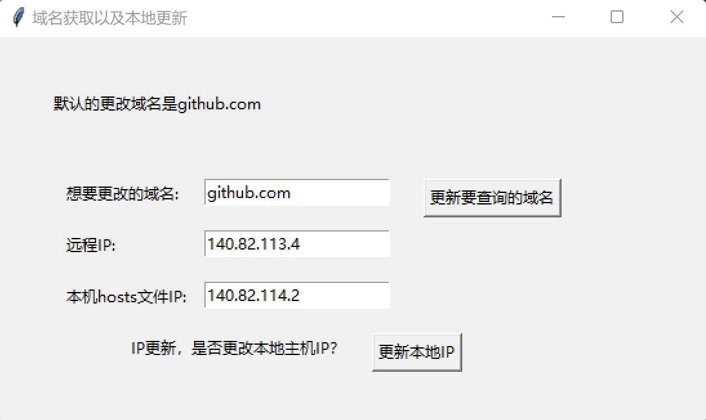

# githubIpUpdate
## 问题背景
如果不使用梯子的话，访问GitHub经常会超时。背后的原因是GitHub的IP地址经常改变，而本地的hosts文件没有改变，无法建立合适的DNS映射。
## 解决方案
首先根据网站https://ipaddress.com/website/github.com, 可以查询到当前的网站的IP。
然后根据C:/Windows/System32/drivers/etc/hosts，得到本地中的DNS的映射
## 代码结构
- getRemoteHost.py 获取当前的正确的IP
- getLocalHost.py 获取本地的IP，并且实现更新查询等功能
- gui 利用tk库进行封装
## 效果展示

## 功能扩展
- 封装成一个exe文件，直接打开运行即可
- 查询不同的网站，如google.com,同样可以进行更新IP
